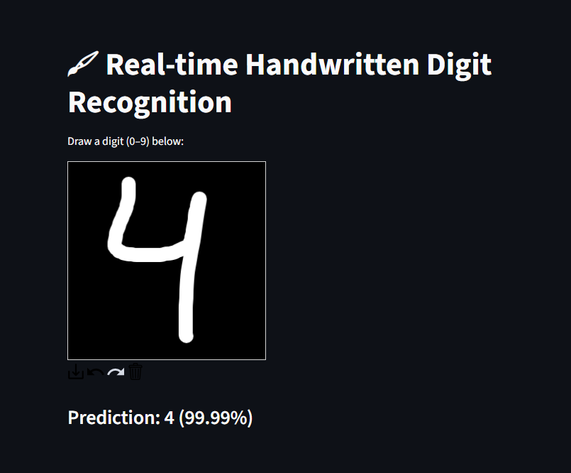
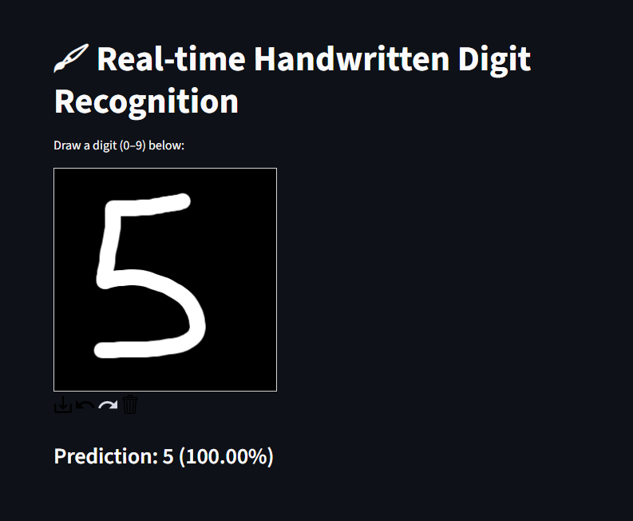

# Handwritten-Digit-Recognition

This project is a web-based digit recognizer using a Convolutional Neural Network (CNN) trained on the MNIST dataset. You can draw a digit (0–9) in a canvas, and the app will predict the number in real-time with a confidence score.

---

## 📦 Features
- Draw any digit on an interactive canvas
- Real-time prediction using a trained CNN model
- Confidence score for each prediction
- Built using PyTorch, Streamlit, and a custom-trained CNN

---

## 🛠️ Tech Stack
- **Frontend**: Streamlit + `streamlit-drawable-canvas`
- **Model**: CNN in PyTorch
- **Dataset**: [MNIST handwritten digits](http://yann.lecun.com/exdb/mnist/)
---

## 🖼️ Screenshots

### Model Prediction

---

## 📄 License
This project is licensed under the MIT License.
